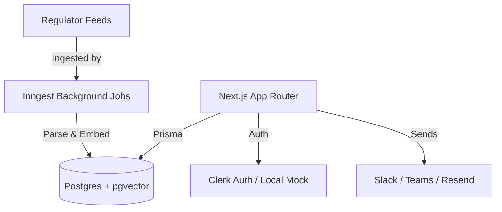
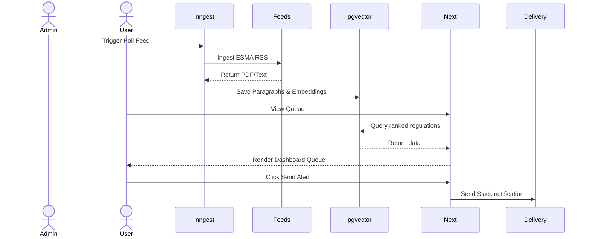
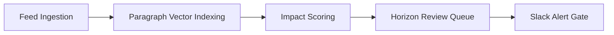
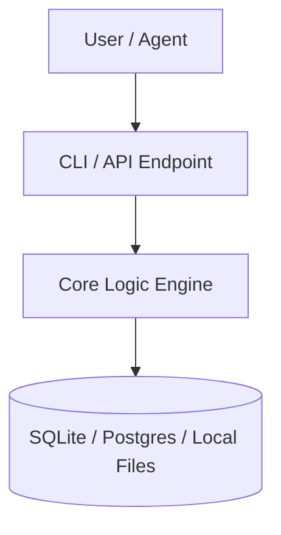

# Architecture: eu-financial-reg-horizon-scanner

## High Level Architecture
Built with Next.js 16 (App Router), React 19, strict TypeScript, and Tailwind CSS. It uses Prisma ORM with PostgreSQL (`pgvector`, `pg_trgm` extensions) for data management and vector similarity search. Background jobs are handled via Inngest. Authentication support is Clerk-ready, with local mock fallbacks enabled.

### System Overview



### Data Flow



### Feature Map



### Folder Structure

```
- AGENTS.md\n- CLAUDE.md\n- LICENSE\n- README.md\n- components.json\n- config/\n  - agents.yaml\n  - scoring-rules.yaml\n  - taxonomy.yaml\n- docker-compose.yml\n- docs/\n  - BACKLOG.md\n  - LAW_FIRM_MODE_PLAN.md\n  - launch/\n    - launch-post.md\n  - launch-readiness.md\n- eslint.config.mjs\n- next-env.d.ts\n- next.config.ts\n- package-lock.json\n- package.json\n- postcss.config.mjs\n- prisma/\n  - migrations/\n    - 20260520090000_pilot_ready_core/\n    - 20260526083000_clerk_organisation_mapping/\n    - 20260526094500_hubspot_alert_channel/\n    - 20260526095000_source_polling_policy/\n    - 20260527110000_structured_classification_status/\n    - 20260527111500_repair_seeded_service_topics/\n    - 20260527112500_reconcile_authorisation_routes/\n    - 20260527130000_product_map_scoring_provenance/\n    - 20260527133000_product_map_confirmation_cadence/\n    - 20260528100000_agent_substrate/\n    - 20260529100000_law_firm_mode/\n    - migration_lock.toml\n  - schema.prisma\n  - seed.ts\n- prisma.config.ts\n- public/\n  - file.svg\n  - globe.svg\n  - next.svg\n  - vercel.svg\n  - window.svg\n- scripts/\n  - ingest-fixtures.ts\n  - smoke-routes.ts\n- src/\n  - app/\n    - actions.ts\n    - agents/\n    - alerts/\n    - api/\n    - audit/\n    - briefing/\n    - digest/\n    - error.tsx\n    - favicon.ico\n    - globals.css\n    - integrations/\n    - law-firm/\n    - layout.tsx\n    - not-found.tsx\n    - page.tsx\n    - product-maps/\n    - publications/\n    - review/\n    - service-catalogue/\n    - sign-in/\n    - sign-up/\n    - sources/\n  - components/\n    - action-notice.tsx\n    - app-shell.tsx\n    - auth-controls.tsx\n    - auth-provider.tsx\n    - impact-explanation-panel.tsx\n    - product-map-confirmation-badge.tsx\n    - publication-filters.tsx\n    - publication-table.tsx\n    - status-badge.tsx\n    - tag-list.tsx\n  - inngest/\n    - client.ts\n    - functions.ts\n  - lib/\n    - agents/\n    - ai/\n    - alerts.ts\n    - audit.ts\n    - authz.ts\n    - delivery.ts\n    - diff.ts\n    - env.ts\n    - extraction.ts\n    - hash.ts\n    - impact-recalculation.ts\n    - impact-scoring.ts\n    - ingestion/\n    - integration-configs.ts\n    - law-firm.ts\n    - mock-data.ts\n    - operator-command-center.ts\n    - paragraph-diff.ts\n    - pilot-briefing.ts\n    - prisma.ts\n    - product-map-assurance.ts\n    - product-maps.ts\n    - publications.ts\n    - review-readiness.ts\n    - review.ts\n    - runtime-hardening.ts\n    - runtime-shell.ts\n    - saved-views.ts\n    - score-explanation.ts\n    - scoring-rules.ts\n    - service-offerings.ts\n    - source-diligence.ts\n    - source-health.ts\n    - taxonomy.ts\n    - utils.ts\n  - proxy.ts\n- tests/\n  - agents.test.ts\n  - alert-delivery.test.ts\n  - api-routes.test.ts\n  - authz.test.ts\n  - classification.test.ts\n  - docs-proof.test.ts\n  - env.test.ts\n  - extraction.test.ts\n  - fixtures/\n    - esma-rss.xml\n  - impact-scoring.test.ts\n  - integration-configs.test.ts\n  - law-firm.test.ts\n  - operator-command-center.test.ts\n  - paragraph-diff.test.ts\n  - pilot-briefing.test.ts\n  - product-map-assurance.test.ts\n  - readiness.test.ts\n  - review-readiness.test.ts\n  - review.test.ts\n  - rss.test.ts\n  - runtime-shell.test.ts\n  - saved-views.test.ts\n  - score-explanation.test.ts\n  - service-offerings.test.ts\n  - source-diligence.test.ts\n  - source-health.test.ts\n  - taxonomy.test.ts\n  - versioning.test.ts\n- tsconfig.json\n- tsconfig.tsbuildinfo\n- vitest.config.ts
```

## Main Modules
- **Core Engine**: Handles business rules and automation.
- **Interfaces**: Connects CLI/HTTP interfaces with core services.

## Data Flow


## Persistent Model
Data is persisted locally via SQLite, local files, or Postgres depending on environment configuration.

## Design Decisions
- Local-first architecture to prevent vendor dependency and data leakage.
- Strict validation schemas (Zod/Pydantic) to check compliance criteria.


## Architecture Diagram


