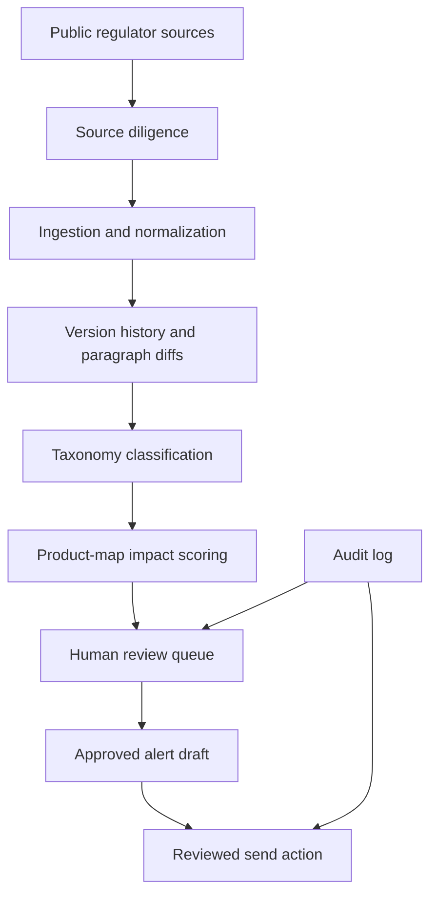

# Launch Readiness

This document explains how to evaluate and run the EU Financial Reg Horizon Scanner.

## What this repo proves

The scanner turns public regulatory change into a governed legal workflow. It ingests public regulator publications, classifies them against a legal taxonomy, scores impact against product maps, routes items through human review and prepares alert drafts that are not sent without explicit approval.

The core proof is legal operations architecture for regulated companies: source diligence, taxonomy design, product relevance, review queues, audit logs and delivery gates.

## Architecture



## Local launch path

Demo mode without persistence:

```bash
npm install
cp .env.example .env.local
npm run dev
```

Persistent mode:

```bash
docker compose up -d
npm run prisma:generate
npm run prisma:migrate
npm run prisma:seed
npm run dev
```

## Demo path

1. Start the app.
2. Open the dashboard.
3. Inspect demo or seeded regulator publications.
4. Review taxonomy classification and impact scoring.
5. Edit or confirm reviewer corrections.
6. Generate an alert draft.
7. Confirm that sending is blocked until human approval.
8. Inspect audit events and source diligence records.

## Checks

```bash
npm run lint
npm run typecheck
npm run test
npm run prisma:validate
npm run ingest:fixture
npm run smoke:routes
npm run build
npm audit --omit=dev
```

## Sample data rule

Use public regulator publications and synthetic product maps. Do not put confidential client product maps, legal advice, internal risk registers or unpublished supervisory correspondence into demo mode.

## Safety posture

No legal, client, recruiting or public communication should be sent automatically. Public-source classification may be AI-assisted only when configured explicitly and only for public publication text. Product-map impact scoring should remain deterministic and local unless a specific governance decision changes that design.

## Good evaluator route

A reviewer should inspect the README, this file, `config/taxonomy.yaml`, `config/scoring-rules.yaml`, `src/lib/ingestion`, `src/lib/impact-scoring.ts`, `src/lib/review.ts`, `src/lib/alerts.ts`, `src/lib/delivery.ts` and the route smoke tests. The key signal is that regulatory intelligence is treated as an auditable workflow, not as a newsletter generator.